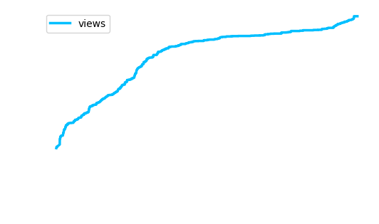

# Joel Thomas Chacko

## About Me

Currently, working on a browser extension to enable users to have a focused browser experience, and on Loccle.

----

### 📦 **Recent Module: Context-Aware Jenkins Job Transfers**

I’ve recently published a new module that automates and simplifies Jenkins job migrations. It is designed to transfer job in a context-aware manner with relevant plugins and views along with its configurations dynamically, making your Jenkins workflows more efficient and less error-prone.

To get started, install the module via pip:

```bash
pip install context-aware-jenkins-job-transfers
```

Check out the documentation [here](https://context-aware-jenkins-transfers-documentation.readthedocs.io/en/latest/index.html#).

----

<details>
  <summary><strong>🔧 Technologies & Tools I Work With</strong></summary>

  <br>

  <!-- Programming Languages -->
  <p>
    
    
    
    
    
  </p>

  <!-- DevOps & Tools -->
  <p>
    
    
    
    
    
  </p>

  <!-- Cloud & BI -->
  <p>
    
    
    
    
    
  </p>

</details>


---

<details>
  <summary><strong>🌐 Connect with Me</strong></summary>

  <br>

  <p>
    <a href="https://www.linkedin.com/in/joelkariyalil">
      
    </a>
    <a href="https://www.instagram.com/joelkariyalil">
      
    </a>
    <a href="mailto:joelkariyalil@gmail.com">
      
    </a>
  </p>

</details>


---

### ☕ **Support My Work**

[](https://buymeacoffee.com/joelkariyalil)


<p align="center">
  
</p>